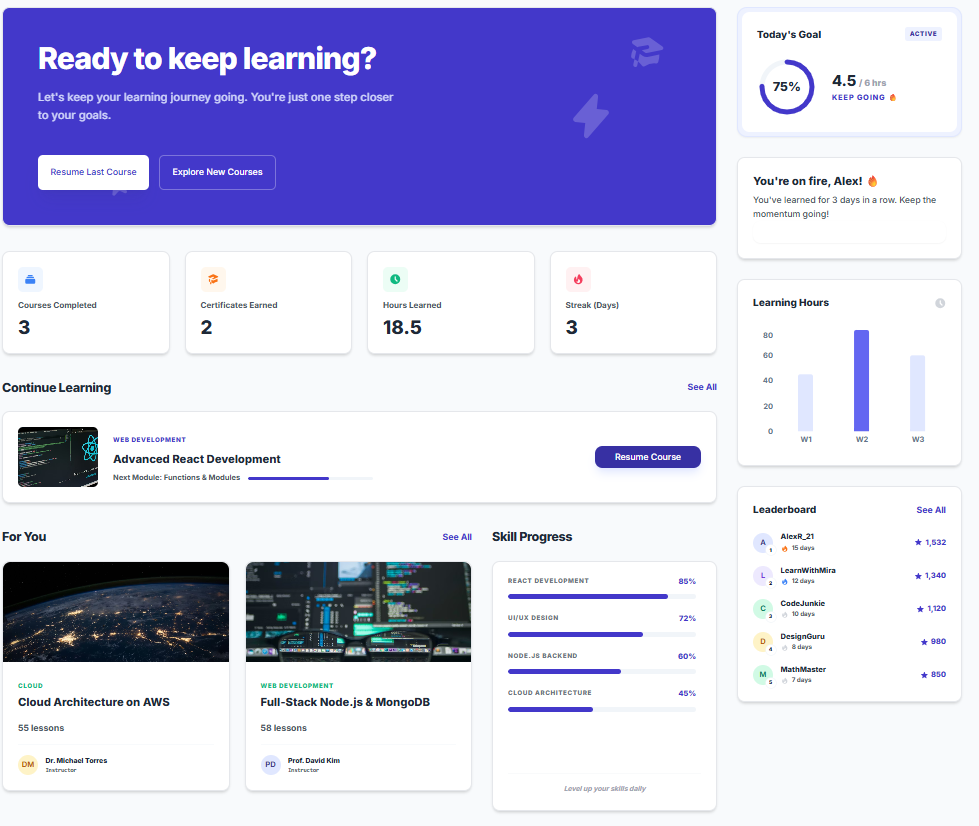
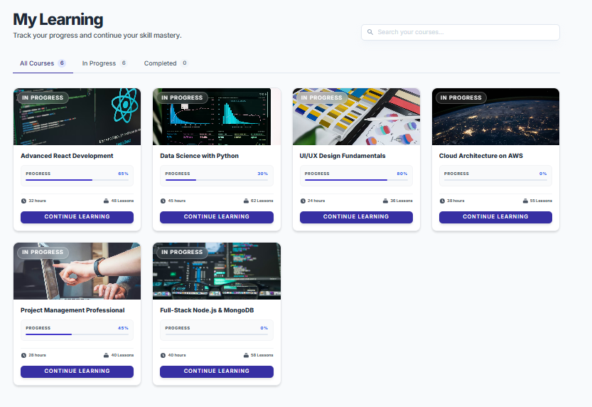
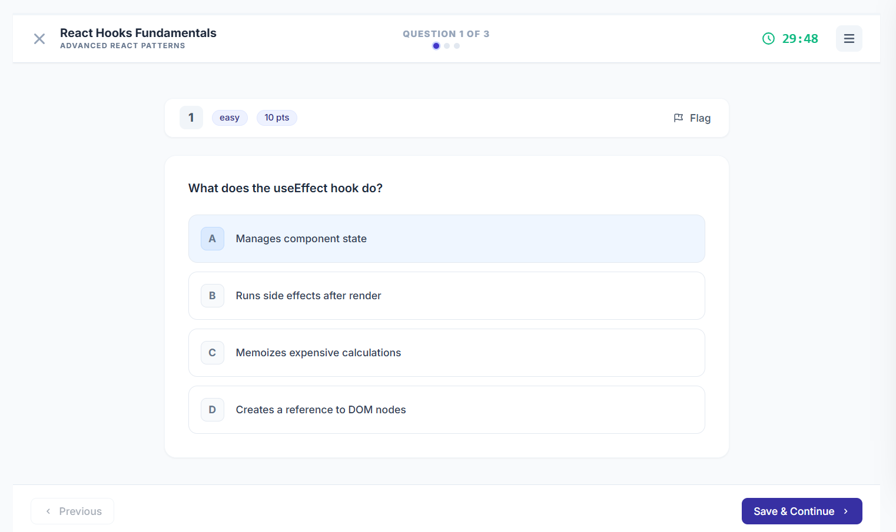
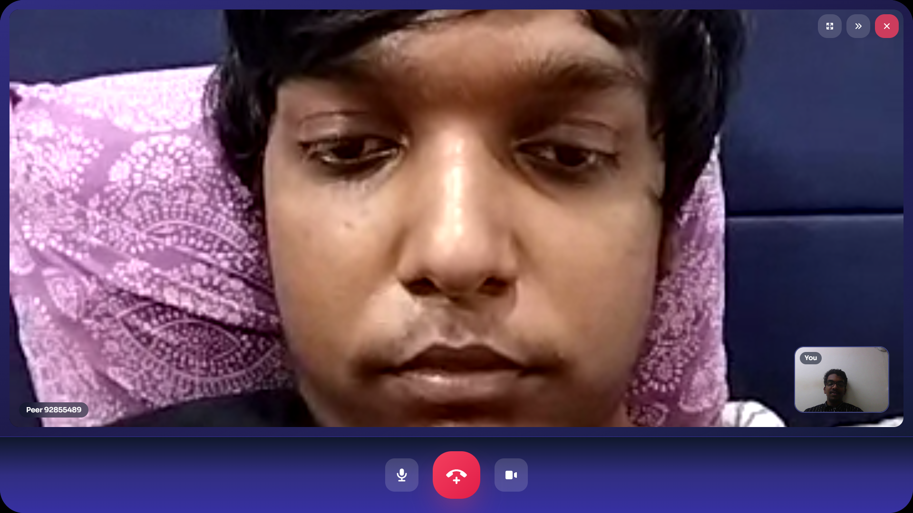
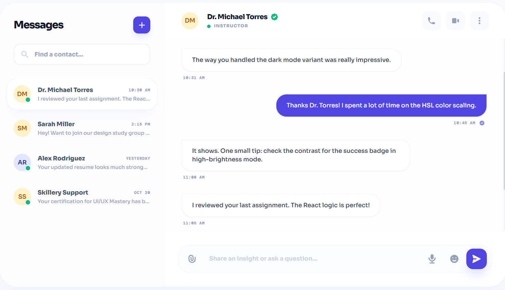
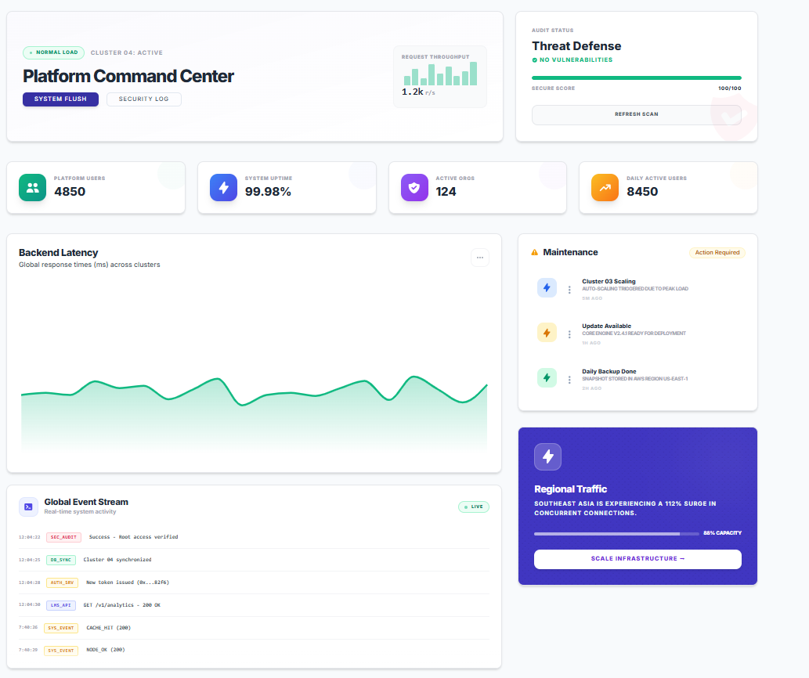
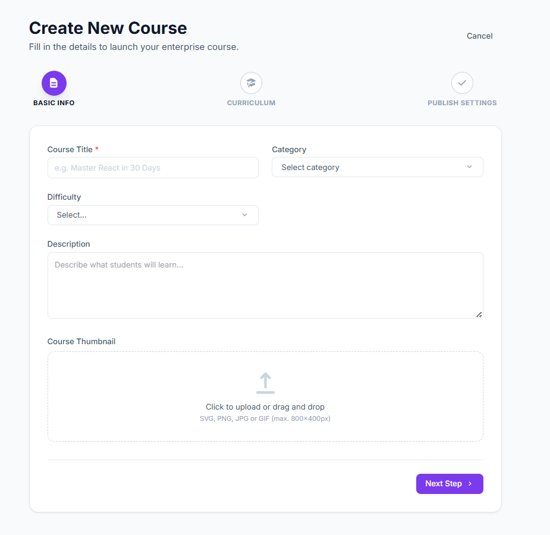
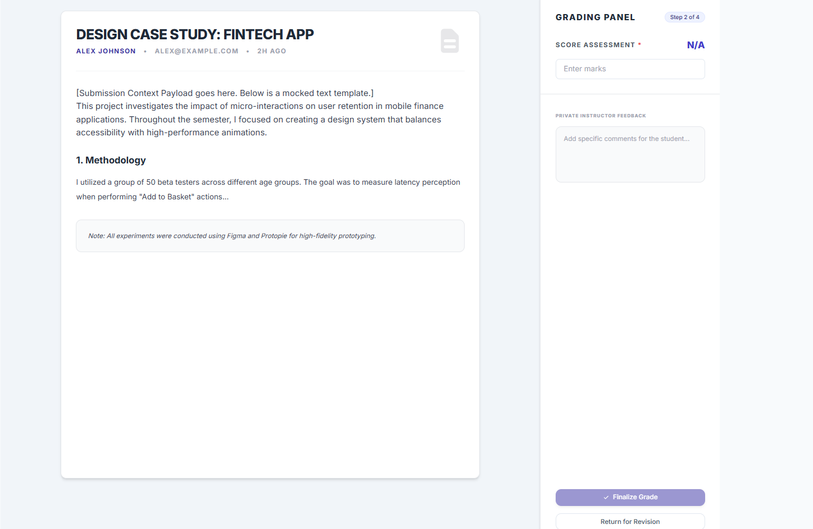
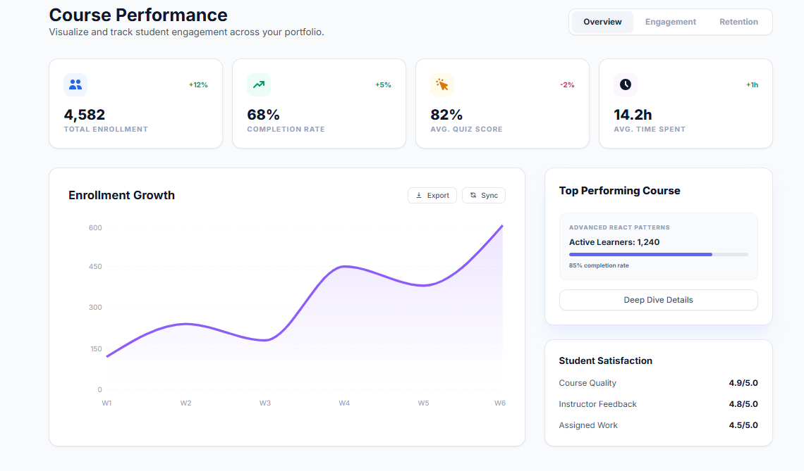

# 🎓 Learning Management System (LMS)

A production-ready, enterprise-grade Learning Management System built with modern web technologies.

**Status:** ✅ Production Ready | **Version:** 1.0.0

---

## 📸 Screenshots

| Learner Dashboard | Course Catalog | Quiz Interface |
|---|---|---|
|  |  |  |

| Video Call | Messaging | Admin Dashboard |
|---|---|---|
|  |  |  |

| Course Builder | Grading Workspace | Analytics |
|---|---|---|
|  |  |  |

---

## 🛠 Tech Stack

### Backend
```
✓ Node.js (v18+)
✓ Express.js 4.21.2
✓ MongoDB 8.9.1 + Mongoose
✓ Socket.io 4.8.3
✓ Agora RTC SDK
✓ JWT + Google OAuth 2.0
✓ Nodemailer 8.0.6
✓ Multer 1.4.5
✓ Helmet 8.0.0, bcryptjs 2.4.3
✓ express-validator 7.2.1
```

### Frontend
```
✓ React 19.2.5 + Vite 8.0.9
✓ Redux Toolkit 2.11.2
✓ Tailwind CSS 3.4.19
✓ React Router v7
✓ Socket.io-client 4.8.3
✓ Agora RTC SDK-NG 4.24.3
✓ Axios 1.15.2
✓ Framer Motion 12.38.0
✓ Recharts 3.8.1
✓ React Hot Toast 2.6.0
```

---

## ✨ Key Features

### 🎯 For Learners
- Course discovery and enrollment
- Progress tracking with dashboards
- Video lessons with playback control
- Quiz attempts with instant scoring
- Assignment submissions and feedback
- Real-time messaging and video calling
- Discussion forums
- Certificate generation
- Leaderboard and achievements

### 👨‍🏫 For Instructors
- Course creation and management
- Lesson uploads and scheduling
- Assignment and quiz creation
- Student submission review and grading
- Progress monitoring and analytics
- Announcement broadcasting
- Certificate issuance

### 🔐 For Administrators
- User management and approval
- Course moderation
- System analytics
- Audit logs and activity tracking
- Role-based access control
- System configuration

---

## 🚀 Quick Start

### Prerequisites
- **Node.js** v18+
- **MongoDB** 4.4+
- **npm** or **yarn**

### Installation

#### Backend
```bash
cd Backend
npm install
cp .env.example .env
# Edit .env with your configuration
npm run dev
```

#### Frontend (New Terminal)
```bash
cd Frontend
npm install
npm run dev
```

**URLs:**
- Backend: `http://localhost:5000`
- Frontend: `http://localhost:5173`

---

## ⚙️ Environment Configuration

### Backend (.env)
```env
NODE_ENV=production
PORT=5000
MONGODB_URI=mongodb://your-mongodb-uri
JWT_SECRET=your-super-secret-jwt-key
JWT_EXPIRES_IN=30d
CLIENT_URL=http://localhost:5173

# Email Service
EMAIL_HOST=smtp.gmail.com
EMAIL_PORT=587
EMAIL_USE_TLS=true
EMAIL_HOST_USER=your-email@gmail.com
EMAIL_HOST_PASSWORD=your-app-password

# Agora RTC
AGORA_APP_ID=your-agora-app-id
AGORA_APP_CERTIFICATE=your-agora-certificate

# Google OAuth (Optional)
GOOGLE_CLIENT_ID=your-google-client-id
GOOGLE_CLIENT_SECRET=your-google-client-secret
```

### Frontend (.env)
```env
VITE_API_BASE_URL=http://localhost:5000
VITE_SOCKET_URL=http://localhost:5000
```

---

## 📚 API Endpoints

### Authentication
```
POST   /api/auth/register
POST   /api/auth/login
POST   /api/auth/verify-otp
POST   /api/auth/google-signin
POST   /api/auth/forgot-password
GET    /api/auth/profile
```

### Courses
```
GET    /api/course
POST   /api/course
GET    /api/course/:id
PUT    /api/course/:id
POST   /api/enrollment/enroll
```

### Quizzes
```
GET    /api/quiz/:courseId
POST   /api/quiz-attempt
GET    /api/quiz/:id/results
```

### Lessons
```
GET    /api/lesson/:courseId
POST   /api/lesson
GET    /api/lesson/progress
```

### Messaging & Calls
```
GET    /api/messages
POST   /api/messages
POST   /api/agora/token
```

### Progress & Analytics
```
GET    /api/progress/dashboard
GET    /api/progress/:userId
POST   /api/dashboard
```

---

## 🔐 Authentication & Security

### Features
- JWT authentication with 30-day expiration
- Bcrypt password hashing
- Role-based access control (RBAC)
- CORS configured
- Helmet security headers
- Input validation and sanitization
- Google OAuth 2.0 support

### User Roles
- **ADMIN** - System management and moderation
- **INSTRUCTOR** - Course creation and grading
- **LEARNER** - Course enrollment and participation

---

## 🌐 Real-Time Features

### Socket.io Events
```javascript
// Messages
socket.on('message:new')
socket.emit('message:send')

// Calls
socket.on('call:incoming')
socket.emit('call:accept')
socket.emit('call:reject')
socket.emit('call:end')

// Notifications
socket.on('notification:new')
```

### Video Calling
- Real-time 1-on-1 and group video calls
- Audio-only calling option
- Screen sharing capabilities
- Automatic token generation

---

## 🚢 Deployment

### Build for Production
```bash
# Frontend
cd Frontend
npm run build
# Output: dist/ folder

# Backend
npm run start  # Uses production NODE_ENV
```

### Deployment Platforms
- **Frontend:** Vercel, Netlify, AWS S3 + CloudFront
- **Backend:** Heroku, AWS EC2, DigitalOcean, Railway
- **Database:** MongoDB Atlas, AWS DocumentDB
- **Files:** AWS S3, Cloudinary, Firebase

### Pre-Deployment Checklist
- ✅ Environment variables configured
- ✅ MongoDB connection secured
- ✅ SSL/TLS certificates installed
- ✅ Email service configured
- ✅ Agora credentials set
- ✅ Database backups enabled
- ✅ File upload directories secured

---

## 📈 Code Quality

```bash
# Run ESLint
cd Frontend
npm run lint

# Production build test
npm run build
```

**Status:** ✅ All linting passed | ✅ No mock data | ✅ Premium UI applied

---

## 📁 Project Structure

```
Learning Management System/
├── Backend/
│   ├── modules/          (auth, user, course, lesson, quiz, etc.)
│   ├── config/           (database, environment, socket)
│   ├── middleware/       (auth, error, role, upload)
│   ├── routes/
│   ├── scripts/
│   ├── uploads/
│   └── utils/

├── Frontend/
│   ├── src/
│   │   ├── components/   (reusable UI components)
│   │   ├── pages/        (page-level components)
│   │   ├── features/     (Redux slices)
│   │   ├── services/     (API services)
│   │   ├── hooks/        (custom React hooks)
│   │   ├── store/        (Redux store)
│   │   └── utils/        (utilities)
│   └── public/

└── scripts/              (root utilities)
```

---

## 📖 Documentation

- [Backend Setup](./Backend/README.md)
- [Frontend Setup](./Frontend/README.md)
- [Tech Stack Details](./TECH_STACK.md)
- [Deployment Checklist](./DEPLOYMENT_CHECKLIST.md)

---

## 🤝 Contributing

1. Create feature branch: `git checkout -b feature/your-feature`
2. Make changes and test locally
3. Run linter: `npm run lint`
4. Commit with clear messages
5. Create pull request

---

<div align="center">

Built with ❤️ for educators and learners worldwide.

© 2026 Learning Management System. All rights reserved.

</div>
